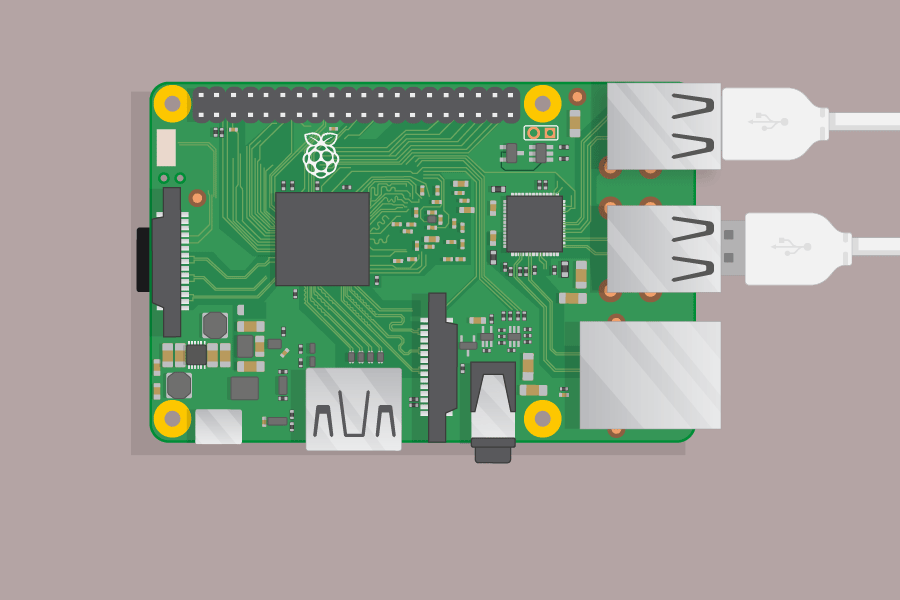
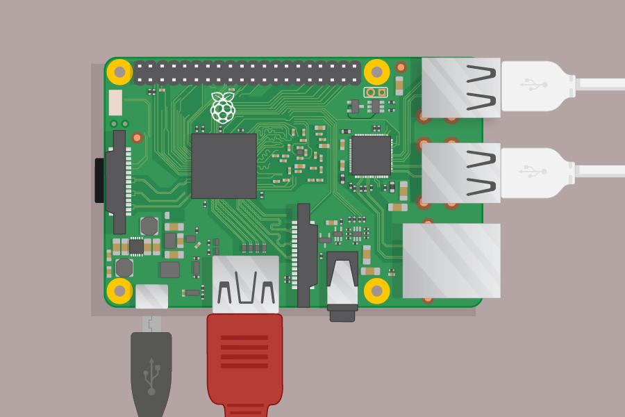
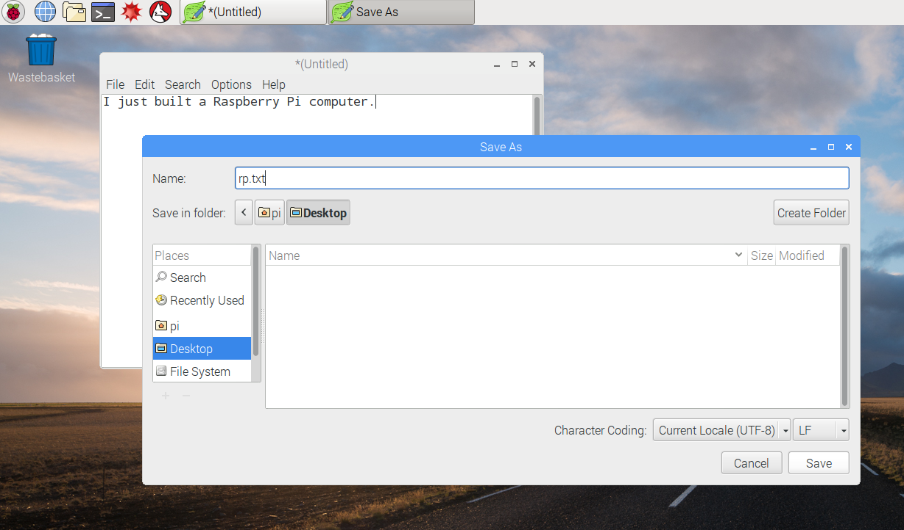
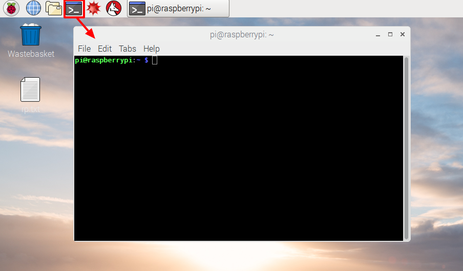
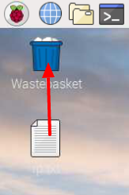

#Introduction:  { .intro}

In this project you will connect up a Raspberry Pi computer and find out what it can do. 


The Raspberry Pi is a small computer that can do lots of things. It plugs into a monitor and you attach a keyboard and mouse. 

For this project you will need:

+ A Raspberry Pi computer with an SD card
+ A monitor with a cable and, if needed, an adaptor
+ A USB keyboard and mouse
+ A power supply
+ Optionally, headphones or speakers
+ Optionally, an ethernet cable


#Step 1: Meet the Raspberry Pi  { .activity}

Let's take a look at the Raspberry Pi. You should have a Raspberry Pi computer in front of you for this. It shouldn't be connected to anything yet. 

## Activity Checklist { .check}

Look at your Raspberry Pi. Can you find all the things labelled on the diagram. 


    
+ __USB ports__ - these are used to connect a USB mouse and keyboard and other peripherals such as a USB storage drive. 

+ __SD Card slot__ - the SD card slots in underneath the Raspberry Pi, this is where the operating system and your files are stored. 
    
+ __Ethernet port__ - this is used to connect the Raspberry Pi to the network (it can also connect to a Wifi network)

+ __Audio Jack__ - this is where you connect headphones or speakers.

+ __HDMI Port__ - this is where you connect the monitor (or projector) that you are using to display the output from the Pi. If your monitor has speakers you can also get sound. 

+ __Micro USB Power connector__ - this is where you connect a power supply. You should always do this last. 

+ __GPIO Ports__ - these allow you to connect electronics components such as LEDs and buttons to the Pi.  


## Challenge: Explain the Pi to a Friend { .challenge}

Take turns explaining parts of the Raspberry Pi with a friend. 

#Step 2: Connect Your Pi

Now you're going to connect up your Raspberry Pi and get it running. 

+ Check that your Raspberry Pi has an SD card in the slot underneath the Pi, if not, ask your Club Leader for help. 


+ Find the USB connector for your mouse. 

Make sure the USB symbol is facing upwards and connect the keyboard to a USB port on the Raspberry Pi. It doesn't matter which one.

 

+ Connect the keyboard in the same way. 

 

+ Look at the HDMI port and notice that it has a large flat side on top.

 

Make sure your monitor is plugged in and turned on. 

Connect the monitor cable to the HDMI port, using an adapter if necessary. 

Nothing will display yet.  

+ Optionally, connect headphones or speakers to the Audio Jack. 

+ Optionally, connect an ethernet cable from an ethernet socket to the ethernet port on the Raspberry Pi. (You don't need to do this if you'll be using Wifi or not connecting to the internet.)

+ Notice that the micro USB power port has a longer flat side on top. 

Plug in the power supply and connect it to the micro USB power input. 

 

You should see a red light on the Raspberry Pi and raspberries on the monitor. 

The Pi will boot up into a graphical desktop. 

 


#Step 3: A Tour of the Pi

Now it's time to take a tour of the Raspberry Pi. 

+ See that Raspberry up in the top-left corner? That's the menu, click on it and you will find lots of applications. 

+ Click 'Accessories' and choose 'Text Editor'

  

+ Type `I just built a Raspberry Pi` in the window that appears.

  

+ Choose 'File' then 'Save' and then click 'Desktop' and save the file as 'rp.txt'

  

+ You should see 'rp.txt' appear on the desktop. 

  

+ Your file has been saved to the Raspberry Pi's SD card. 

+ Close the text editor by clicking the 'X'

+ Return to the Raspberry menu and choose 'Shutdown' and then choose 'Restart'. 

+ When the Pi reloads your file should still be there. 

+ The Raspberry Pi runs a version of an operating system called Linux (Windows and OS X are other operating systems.) You can type commands to do things. Click on the Command Prompt at the top of the screen:

  

+ Now type: 

```
ls
``` 

and then press enter on the keyboard.

This will list the files in your 'home' directory (folder.)

+ Now type:

```
cd Desktop
```

You have to press the enter key after every command. 

Type: 

```
ls
``` 

Can you see the file you created?

+ Close the command prompt by clicking on the 'X'. 

+ Now drag `rp.txt` to the Wastebasket in the desktop so the Pi will be ready for the next person.  



Step 4: Browsing the Web (Optional)

+ If you're not using an ethernet cable then you'll need to connect to a wireless network. 

+ Click the Wifi icon on the top-right of the screen and ask your Club Leader for Wifi access details. 


+ Click the Web Browser icon and search for `raspberry pi`.


## Challenge: Explore the Pi { .challenge} 

Take some time to explore the Pi. 

Can you find:

+ A version of Scratch

+ A Python game to play 

+ A version of Minecraft that you can program (you'll find out more about that later.)

If you are connected to the internet then you can also try browsing the web. 

+ Can you find out how the Raspberry Pi got its name?

Note: You can also try any of the regular [Code Club projects](codeclubprojects.org) on the Raspberry Pi. 


