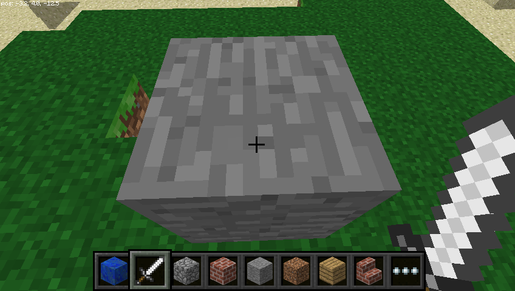
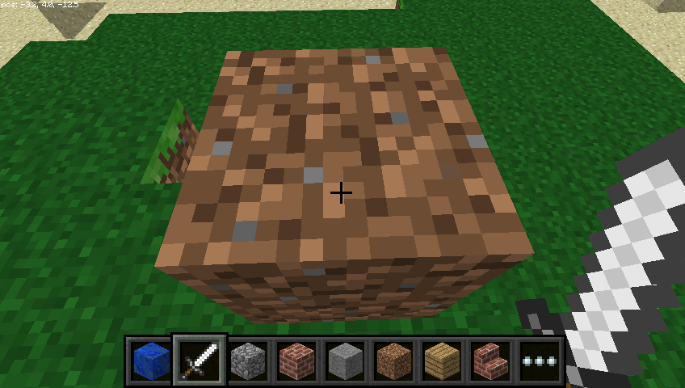
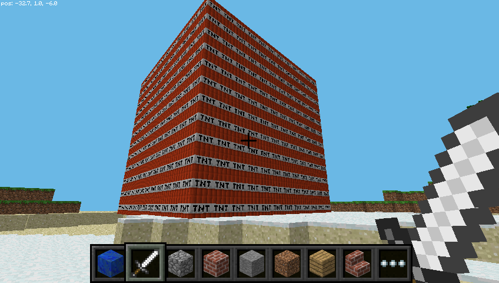

# Introduction { .intro}

Au cours de ce projet, vous allez explorer le monde virtuel de Minecraft Pi, l'édition spéciale de Minecraft développée pour le Raspberry Pi. Vous apprendrez à contrôler le joueur, à construire avec des blocs manuellement et à utiliser l'interface Python pour manipuler le monde autour de vous.


Minecraft est un jeu vidéo très populaire de type construction libre ("sandbox"). Une version gratuite de Minecraft est disponible pour le Raspberry Pi. Cette version vient aussi avec une interface de programmation. Vous pouvez ainsi écrire des commandes et scripts en language Python pour construire et manipuler des éléments dans le jeu automatiquement. C'est une bonne manière d'apprendre Python!

# Étape 1: Lancer et utiliser Minecraft { .activity}

## Liste de contrôle d'activité { .check}

+ Lancez Minecraft à partir du menu ou bien tapez `minecraft-pi` dans le terminal.


+ Une fois Minecraft lancé, cliquez sur __Start Game__, suivi de __Create New__.

(Dans certains cas, il se peut que la fenêtre apparaisse légèrement décalée par rapport à l'affichage du jeu. Cela veut dire que pour déplacer la fenêtre, vous devez attraper la barre de titre derrière l'affichage du jeu.)


Vous êtes maintenant dans une partie de Minecraft! Promenez-vous, modifiez et construisez des choses!

+ Utilisez la souris pour regarder autour de vous et utilisez les touches suivantes du clavier:

Touche | Action
----|-------
W | Déplacement avant
A | Déplacement à gauche
S | Déplacement arrière
D | Déplacement à droite
E | Afficher l'inventaire
Espace | Sauter
Double Espace | Voler / Tomber
Esc | Pause / Menu du jeu
Tab | Relâcher le curseur de souris

+ Vous pouvez choisir des items du panneau d'accès rapide situé au bas de la fenêtre en utilisant la roulette de la souris (ou les chiffres du pavé numérique). Vous pouvez presser `E` et choisir un item de votre inventaire complet.


+ Vous pouvez presser deux fois la barre d'espace pour voler dans les airs. Vous arrêterez de monter en relâchant la barre d'espace et retomberez au sol si vous la pressez deux fois à nouveau.


+ Avec l'épée en main, vous pouvez cliquer sur des blocs devant vous pour les enlever (ou creuser). Avec un bloc en main, vous pouvez utiliser le clic droit pour placer le bloc devant vous ou le clic gauche pour enlever un bloc.

# Étape 2: Utiliser l'interface de programmation Python { .activity}

## Liste de contrôle d'activité { .check}

+ Avec Minecraft Pi lancé et un monde créé, appuyez sur `Tab` pour libérer la souris et accéder au bureau du Raspberry Pi. Lancez Python 3 (IDLE) à partir du menu et déplacez la fenêtre pour qu'elle soit côte-à-côte avec celle de Minecraft Pi.

Vous pouvez soit saisir les commandez directement dans la fenêtre de Python ou bien créer un fichier séparé que vous pourrez sauvegarder et ré-exécuter à nouveau plus tard. Si vous voulez créer un fichier, cliquez `File > New file` puis `File > Save` dans la nouvelle fenêtre.

+ Commencez par importer la librarie Minecraft Pi, créer une connection avec le jeu et la tester en affichant un message "Bonjour monde Minecraft" à l'écran.
```Python
    from mcpi.minecraft import Minecraft

    mc = Minecraft.create()

    mc.postToChat("Bonjour monde Minecraft!")
```

Si vous entrez les commandes dans la fenêtre Python, pressez Entrée (Enter) après chaque ligne. Si vous utilisez un fichier, sauvegardez le d'abord avec `Ctrl + s` puis exécutez le avec `F5`. Lorsque votre code s'exécute, vous devriez voir votre message s'afficher dans la fenêtre du jeu.


## Trouvez votre position  { .activity}

## Liste de contrôle d'activité { .check}

+ Pour trouver votre position, tapez:
```Python
    pos = mc.player.getPos()
```

`pos` contient maintenant votre position. Accédez chacune des coordonnées avec `pos.x`, `pos.y` et `pos.z`.

+ Alternativement, vous pouvez assigner les coordonnées à des variables indépendantes en utilisant la technique de décompression de Python:
```Python
    x, y, z, = mc.player.getPos()
```

`x`, `y` et `z` contiennent maintenant chacune une partie des coordonnées de votre position. `x` et `z` sont les directions horizontales (avant/arrière et gauche/droite) et `y` est la direction verticale (haut/bas).

Notez que la fonction `getPos()` retourne la position du joueur au moment où elle est appelée. Si vous changez votre position, vous devrez appeler la fonction à nouveau ou bien utiliser la position stockée dans `pos` ou dans `x`, `y` et `z`.

## Téléportation { .activity}

## Liste de contrôle d'activité { .check}

+ En plus de trouver votre position, vous pouvez spécifier une position particulière où vous téléporter.
```Python
    x, y, x = mc.player.getPos()
    mc.player.setPos(x, y+100, z)
```

Ceci déplacera votre joueur à une hauteur de 100 blocs dans les airs. Cela veut dire que vous vous téléporterez au milieu du ciel et retomberez là où vous étiez.

+ Essayez de vous téléporter ailleurs!

## Placer des blocs { .activity}

## Liste de contrôle d'activité { .check}

+ Vous pouvez placer un bloc unique à des coordonnées spécifiques avec la fonction `mc.setBlock()`:
```Python
    x, y, z = mc.player.getPos()
    mc.setBlock(x+1, y, z, 1)
```

Un bloc de pierre devrait apparaître à côté de là où vous vous trouvez. S'il n'est pas directement devant vous, il peut être à côté ou derrière vous. Retournez à la fenêtre Minecraft et utilisez la souris pour tourner sur place jusqu'à-ce que vous voyez un bloc gris directement devant vous.



Les arguments passés à la fonction `setBlock` sont `x`, `y`, `z` et `id`. `(x, y, z)` correspond à la position dans le monde (nous avons spécifié un bloc à côté de la position du joueur avec `x + 1`) et `id` correspond au type de bloc à placer. `1` correspond à de la pierre ("STONE").

+ Vous pouvez essayer les blocs suivants:
```
    Air ("AIR"):         0
    Gazon ("GRASS"):     2
    Poussière ("DIRT") : 3
```

+ Maintenant, avec le bloc en vue, essayez de le changer en d'autre chose:
```python
    mc.setBlock(x+1, y, z, 3)
```

Vous devriez voir le bloc de pierre gris changer devant vos yeux!



## Constantes de blocs { .activity}

## Liste de contrôle d'activité { .check}

+ Vous pouvez utiliser des constantes prédéfinies pour spécifier vos types de blocs si vous connaissez leurs noms (en Anglais). Pour ce faire, vous devrez ajouter une autre ligne `import`:
```Python
    from mcpi import block
```

+ Vous pouvez maintenant écrire le code suivant pour placer un bloc:
```Python
    mc.setBlock(x+3, y, z, block.STONE.id)
```

Les noms des constantes de blocs sont assez faciles à deviner si vous connaissez leur nom Anglais. Dans la majorité des cas, utilisez simplement des MAJUSCULES. Voici quelques noms particuliers que vous pouvez apprendre (essayez-les):

```
    WOOD_PLANKS
    WATER_STATIONARY
    GOLD_ORE
    GOLD_BLOCK
    DIAMOND_BLOCK
    NETHER_REACTOR_CORE
```

## Des blocs comme variables { .activity}

## Liste de contrôle d'activité { .check}

+ Si vous connaissez l'`id` d'un bloc, il peut être utile de le définir comme une variable. Vous pouvez utiliser le nom de constante ou bien l'`id`:

```Python
    dirt = 3
    mc.setBlock(x, y, z, dirt)
```
ou

```Python
    dirt = block.DIRT.id
    mc.setBlock(x, y, z, dirt)
```

## Blocs spéciaux { .activity}

## Liste de contrôle d'activité { .check}

+ Certains blocs ont des propriétés additionnelles, tel que la laine ("WOOL") qui a un paramètre permettant d'en spécifier la couleur. Pour la régler, utilisez le quatrième paramètre optionel de la fonction `setBlock`:
```Python
    wool = 35
    mc.setBlock(x, y, z, wool, 1)
```

Ici, le quatrième paramètre `1` règle la couleur à orange. Sans le quatrième paramètre, elle est réglée à la valeur par défaut `0` qui correspond à blanc. D'autres couleurs disponibles sont:
```
    2: Magenta
    3: Bleu pâle
    4: Jaune
```

+ Essayez d'autre numéros de couleurs et regardez la couleur du bloc changer!

D'autre blocs qui ont des propriétés additionnelles sont le bois ("WOOD", `17`): 'oak', 'spruce', 'birch', etc., le gazon long ("GRASS_TALL", `31`): 'shrub', 'grass', 'fern', etc., la torche ("TORCH", `50`): 'pointing east, west, north, south' et d'autres. Voir la [référence d'API](https://github.com/DrGFreeman/Minecraft-Pi-API-Reference-FR) pour tous les détails.

## Placer plusieurs blocs { .activity}

## Liste de contrôle d'activité { .check}

+ En plus de pouvoir placer des blocs individuels avec `setBlock`, vous pouvez remplir un volume en une seule commande avec `setBlocks`:
```Python
    stone = 1
    x, y, z = mc.player.getPos()
    mc.setBlocks(x+1, y+1, z+1, x+11, y+11, z+11, stone)
```

Ceci remplira un cube de 10 x 10 x 10 blocs de pierre.


Vous pouvez remplir de plus grands volumes avec la fonction `setBlocks` mais il faudra plus de temps pour les générer.

# Étape 3: Placer des blocs en marchant { .activity}

## Liste de contrôle d'activité { .check}

Maintenant que vous savez comment placer des blocs, utilisons votre position en mouvement pour placer des blocs lorsque vous vous déplacez.

+ Le code suivant placera une fleure derrière vous partout où vous irez:
```Python
    from mcpi.minecraft import Minecraft
    from time import sleep

    mc = Minecract.create()

    fleur = 38

    while True:
        x, y, z = mc.player.getPos()
        mc.setBlock(x, y, z, fleur)
        sleep(0.1)
```

+ Maintenant, marchez un certain temps puis tournez vous pour voir les fleurs que vous avez placées derrière vous.


Puisque nous avons utilisé une boucle `while True`, celle-ci continuera indéfiniment. Pour l'arrêter, faites `Ctrl + c` dans la fenêtre Python.

+ Essayez de vous déplacer dans les airs et regardez les fleurs que vous laissez dans le ciel:


+ Que faire si on ne voulait placer des fleurs que si le joueur est sur du gazon? Nous pouvons utiliser `getBlock` pour trouver de quoi est fait un bloc à une position donnée.
```Python
    x, y, z = mc.player.getPos()  # Position du joueur (x, y, z)
    ce_bloc = mc.getBlock(x, y, z)  # id du bloc
    print(ce_bloc)
```

Ceci nous indique l'`id` du bloc à la position _où_ le joueur se trouve (il s'agira de `0`, c'est à dire un bloc d'air). Nous voulons connaître le type de bloc _sur lequel_ le joueur se tient Pour ce faire, nous soustrayons 1 à la valeur `y` et utilisons `getBlock` pour déterminer le l'`id` du bloc sur lequel nous nous trouvons:
```Python
    x, y, z = mc.player.getPos()  # Position du joueur (x, y, z)
    bloc_dessous = mc.getBlock(x, y-1, z)  # id du bloc
    print(bloc_dessous)
```

+ Testez le un exécutant une boucle qui imprime l'`id` du bloc sur lequel le joueur se tient.
```Python
    while True:
        x, y, z = mc.player.getPos()  # Position du joueur (x, y, z)
        bloc_dessous = mc.getBlock(x, y-1, z)  # id du bloc
        print(bloc_dessous)
```


+ Nous pouvons utiliser une condition `if` pour choisir si nous voulons placer une fleur ou non:
```Python
    gazon = 2
    fleur = 38

    while True:
        x, y, z = mc.player.getPos()  # Position du joueur (x, y, z)
        bloc_dessous = mc.getBlock(x, y-1, z)  # id du bloc

        if bloc dessous == gazon:
          mc.setBlock(x, y, z, fleur)
        sleep(0.1)
```

+ Peut-être voudriez vous changer le bloc sur lequel le joueur se tient en gazon s'il n'en est pas déjà? :
```Python
    if bloc_dessous == gazon:
      mc.setBlock(x, y, z, fleur)
    else:
      mc.setBlock(x, y-1, z, gazon)
```

Maintenant nous pouvons marcher et si nous marchons sur du gazon, nous y plaçons une fleur. Si le bloc n'est pas du gazon, nous le changeons en gazon. Lorsque nous nous tournons et rebroussons chemin, nous laissons maintenant une fleur derrière nous.


# Étape 4: Jouer avec des blocs de TNT!  { .activity}

## Liste de contrôle d'activité { .check}

+ Un autre bloc intéressant est le bloc de TNT! Pour placer un bloc de TNT, utilisez:
```Python
    tnt = 46
    mc.setBlock(x, y, z, tnt)
```


+ Toutefois, ce bloc de TNT est plutôt ennuyant. Essayez de régler `data` à `1`:
```Python
    tnt = 46
    mc.setBlock(x, y, z, tnt, 1)
```

+ Maintenant, utilisez votre épée et cliquez à gauche sur le bloc de TNT: Il sera activé et explosera d'ici quelques secondes!

+ Essayez maintenant de créer un énorme cube de blocs de TNT!
```Python
    tnt = 46
    mc.setBlocks(x+1, y+1, z+1, x+11, y+11, z+11, tnt, 1)
```



Vous verrez maintenant un gros cube plein de blocs de TNT. Allez activer un bloc puis courrez pour aller regarder le spectacle d'une bonne distance! Le rendu graphique sera lent étant donné que beaucoup de choses changent en même temps.


# Étape 5: Du plaisir avec la lave en fusion! { .activity}

## Liste de contrôle d'activité { .check}

+ Un bloc qui est très amusant à utiliser est la lave en fusion.
```Python
    from mcpi.minecraft import Minecraft

    mc = Minecraft.create()

    x, y, z = mc.player.getPos()

    lave = 10

    mc.setBlock(x+3, y+3, z = lave)
```

Trouvez le bloc que vous venez de placer et vous devriez voir de la lave en fusion couler du bloc vers le sol.

+ Ce qui intéressant avec la lave c'est qu'en refroidissant elle devient de la pierre. Déplacez vous à une autre position dans le monde et essayez ceci:
```Python
    from mcpi.minecraft import Minecraft
    from time import sleep

    mc = Minecraft.create()

    x, y, z = mc.player.getPos()

    lave = 10
    eau = 8
    air = 0

    mc.setBlock(x+3, y+3, z, lave)
    sleep(20)
    mc.estBlock(x+3, y+5, z, eau)
    sleep(4)
    mc.setBlock(x+3, y+5, z, air)
```

Vous pouvez ajuster les paramètres de la fonction `sleep` pour laisser plus ou moins de lave couler.


# Étape 5: Et ensuite? { .activity}

Il y a de nombreuses autres choses que vous pouvez faire maintenant que vous savez vous déplacer dans le monde de Minecraft et utiliser l'interface de programmation Python.

## Jeu en réseau { .activity}

Si plusieurs personnes connectent des Raspberry Pis à un réseau local, il peuvent joindre le même monde Minecraft et jouer ensemble. Les joueurs peuvent se voir dans le monde Minecraft.

## Référence d'API { .activity}

Pour une documentation complète des fonction de Minecraft Pi et une liste complète des `id` de blocs, vous pouvez consulter la [référence d'API](https://github.com/DrGFreeman/Minecraft-Pi-API-Reference-FR).

## Faites un jeu { .activity}

Essayez un autre ressource et faites un jeu de type "Tape la marmotte": [Minecraft Whac-a-Block](https://www.raspberrypi.org/learning/minecraft-whac-a-block-game/) (ressource en Anglais).
