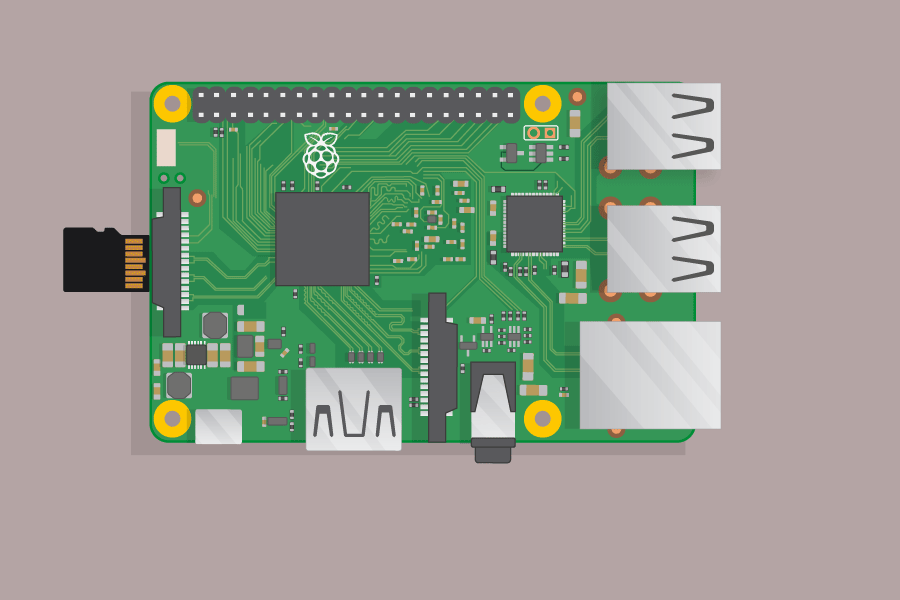
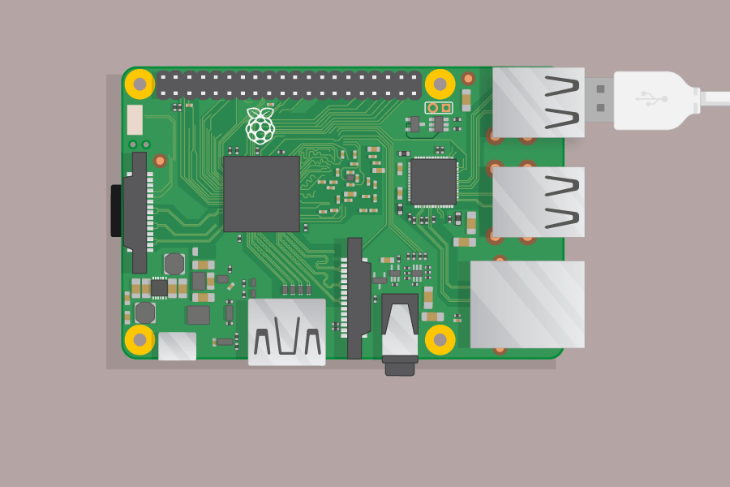
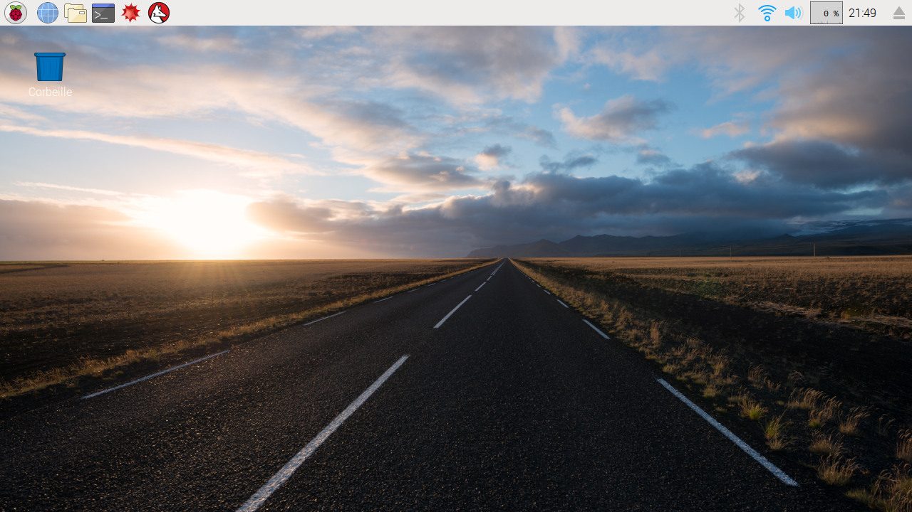

# Introduction:  { .intro}

Au cours de ce projet, vous brancherez un ordinateur Raspberry Pi et découvrirez ce qu'il peut faire.


Le Raspberry Pi est un petit ordinateur qui peut faire bien des choses. On le branche à un moniteur et on y branche un clavier et une souris.

Pour ce projet, vous aurez besoin de:

+ Un ordinateur Raspberry Pi avec une carte microSD

+ Un moniteur avec câble et, si requis, un adaptateur

+ Un clavier et une souris USB

+ Un bloc d'alimentation

+ Des écouteurs ou haut-parleurs (facultatif)

+ Un câble ethernet (facultatif)

# Étape 1: Faites connaissance avec le Raspberry Pi { .activity}

Jetons un coup d'œil au Raspberry Pi. Vous devriez avoir un ordinateur Raspberry Pi devant vous. Il ne devrait être branché à rien pour le moment.

## Liste de contrôle d'activité { .check}

Regardez votre Raspberry Pi. Pouvez-vous trouver tous les éléments identifiés sur le diagramme?


+ __Ports USB__ - ceux-ci sont utilisés pour brancher une souris et un clavier USB, de même que d'autres périphériques USB tels qu'une clé de stockage USB.

+ __Fente pour carte microSD__ - la fente pour carte microSD se trouve sous le Raspberry Pi. C'est là que le système d'exploitation et vos fichiers sont stockés.

+ __Port ethernet__ - celui-ci est utilisé pour brancher le Raspberry Pi au réseau (le Raspberry Pi peut aussi être connecté à un réseau Wifi).

+ __Prise audio__ - c'est là que vous branchez des écouteurs ou haut-parleurs.

+ __Port HDMI__ - c'est là que vous branchez le moniteur (ou télévision ou projecteur) que vous utilisez pour afficher la sortie du Raspberry Pi. Si votre moniteur a des haut-parleurs, vous obtiendrez aussi du son.

+ __Prise d'alimentation micro USB__ - c'est là que vous branchez un bloc d'alimentation. Vous devriez toujours brancher celui-ci en dernier.

+ __Broches GPIO__ - celles-ci vous permettent de brancher des composants électroniques tels que des DELs et boutons au Raspberry Pi.


## Défi: Décrivez le Raspberry Pi à un ami { .challenge}

En équipe avec un ami, expliquez tour à tour les différentes parties du Raspberry Pi.

# Étape 2: Branchez votre Pi { .activity}

Vous allez maintenant brancher votre Raspberry Pi et le démarrer.

+ Vérifiez que votre Raspberry Pi a un carte microSD insérée dans la fente située sous le Pi. Sinon, demandez l'aide de votre leader de club.

	

+ Trouvez le connecteur USB de votre souris.

	Assurez-vous que le symbole USB est sur le dessus et branchez la souris a un port USB du Raspberry Pi. N'importe quel des ports USB convient.

	

+ Branchez le clavier de la même manière.

	

+ Regardez le port HDMI et remarquez qu'il a un côté plat plus long sur le dessus.

	

	Assurez-vous que votre moniteur est branché au secteur et est allumé.

	Branchez le câble du moniteur au port HDMI, en utilisant un adaptateur si nécessaire.

	Rien ne s'affichera pour l'instant.

+ Facultativement, branchez des écouteurs ou haut-parleurs à la prise audio.

+ Facultativement, branchez un câble ethernet d'une prise ethernet au port ethernet du Raspberry Pi. (Vous n'avez pas besoin de ce branchement si vous utiliserez le Wifi pour vous connecter à l'internet.)

+ Remarquez que la prise d'alimentation micro USB a un côté plat plus long sur le dessus.

	Branchez le bloc d'alimentation au secteur et branchez le à la prise d'alimentation micro USB du Raspberry Pi.

	

	Vous devriez voir une lumière rouge sur le Raspberry Pi et des framboises sur le moniteur.

	Le Pi démarrera une interface graphique de bureau.

	


# Étape 3: Une visite du Pi { .activity}

C'est maintenant le temps de faire une visite du Raspberry Pi.

+ Vous voyez la framboise dans le coin supérieur-gauche? C'est le menu. Cliquez dessus et vous y trouverez une multitude d'applications.

+ Cliquez 'Accessoires' et choisissez 'Text Editor' (éditeur de texte).

	  

+ Tapez `J'ai monté un ordinateur Raspberry Pi!` dans la fenêtre qui apparaît.

	  

+ Choisissez 'Fichier' puis 'Enregistrer' et puis cliquez sur 'Bureau' et enregistrez le fichier sous le nom 'rp.txt'.

	  

+ Vous devriez voir l'icone 'rp.txt' apparaître sur le bureau.

	  

+ Votre fichier a été sauvegardé sur la carte microSD du Pi.

+ Fermez l'éditeur de texte en cliquant sur le 'X'.

+ Retournez au menu du Raspberry Pi puis choisissez 'Shutdown...' puis choisissez 'Reboot'.

+ Après que le Pi ait redémarré, votre fichier devrait toujours s'y trouver.

+ Le Raspberry Pi exécute un version d'un système d'exploitation appelé Linux (Windows et OS X sont d'autres systèmes d'exploitation). Vous pouvez taper des commandes pour faire certaines choses. Cliquez sur l'icone de l'invite de commande dans la barre de lancement rapide au haut de l'écran:

	  

+ Maintenant tapez:

	```
	ls
	```

	puis pressez sur Entrée ('Enter') sur le clavier.

	Ceci va énumérer les fichiers dans votre répertoire (dossier) 'home'.

+ Maintenant tapez:

	```
	cd Desktop
	```

	Vous devez presser Entrée après chaque commande.

	Tapez:

	```
	ls
	```

	Pouvez-vous voir le fichier que vous avez créé?

+ Fermez l'invite de commande en cliquant sur le 'X'.

+ Maintenant glissez `rp.txt` dans la corbeille sur le bureau pour que le Pi soit prêt pour le prochain utilisateur.

	

# Étape 4: Navigation Internet (facultatif) { .activity}

+ Si vous n'utilisez pas de câble ethernet, alors vous devrez vous connecter à un réseau sans-fil.

+ Cliquez sur l'icone Wifi en haut à droite de l'écran et demandez à votre leader de club pour les détails de l'accès Wifi.

	

+ Cliquez sur l'icone du Navigateur Internet puis cherchez `raspberry pi`.

	

## Défi: Explorez le Pi { .challenge}

Prenez quelque temps pour explorer le Pi.

Pouvez-vous trouver:

+ Une version de Scratch?

+ Un jeux en Python auquel jouer?

+ Une version de Minecraft que vous pouvez programmer (vous en apprendrez plus à ce sujet plus tard).

Si vous êtes connecté à Internet, alors vous pouvez aussi essayer de naviguer le web.

+ Pouvez-vous trouver l'origine du nom Raspberry Pi?

Note: Vous pouvez aussi essayer n'importe quel des [projets Code Club](https://codeclubprojects.org/) réguliers sur le Raspberry Pi.
